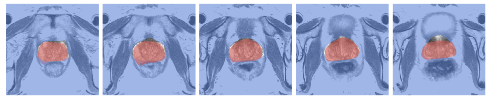
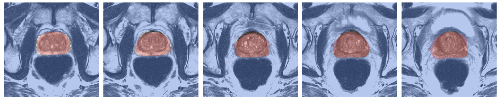
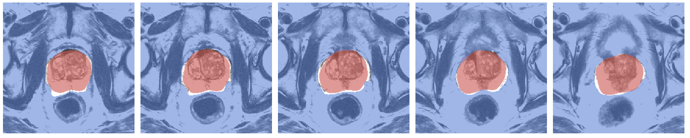
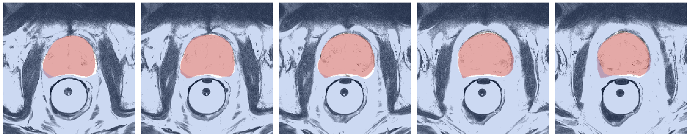

# MRI Expert - Automatic Prostate Segmentation from MRI Using AI!



## Quick Start

1. Download the [Promise 21 Grand Challenge Dataset](https://promise12.grand-challenge.org/), note the path to the TrainingData folder (`"/path/to/TrainingData"`)
   
2. Clone the repository : 
    ```sh
    git clone https://github.com/pfrwilson/mri-expert
    cd mri-expert
    ```
3. Install the requirements : 
   ```sh
   pip install -r requirements.txt
   ```
4. Train and evaluate the model:
   ```sh
   python main.py data.root="/path/to/TrainingData" log=False log_images=False
   ```  
   - If you have wandb, you can set log=True and log_images=True, which will log metrics and media to your wandb account under the project "mri-expert"!

   - You can customize the hyperparameters however you want by changing the config.yaml file - simply adjust the fields and run `python main.py`. The default hyperparameters are the best ones we found. 

5. Following the training, the model weights will be saved under `outputs` as a `checkpoint.pt` file in the directory corresponding to the run.


## Background

Prostate cancer is the second most common cancer in men worldwide and presents a significant burden of disease. There is significant variability in the prostate cancer, ranging from indolent to extremely aggressive tumors. Effective treatment depends on early and accurate diagnosis. First-line tests such as digital rectal examination and prostate-specific antigen testing can identify men at higher risk of having prostate cancer, but a combination of imaging and biopsy is required to confirm diagnosis. The most common technique is transrectal ultrasound (TRUS) guided biopsy of the prostate. Unfortunately, TRUS provides relatively poor visualization of the prostate tissue and gives little information about the presence and location of tumours.

Magnetic Resonance Imaging (MRI) provides a much better of visualization of tissue structures than ultrasound. It can be used to visualize the prostate and surrounding region to diagnose cancer and determine if cancer has spread. It can also be used to identify suspected tumours on the prostate, which can then be targeted directly using TRUS-guided biopsy. An MRI image of the prostate consists of a sequence of 2-dimensional "slices" taken along the axial plane of the body which are combined into a 3-dimensional image volume. 

It is necessary to segment the prostate from the surronding tissue to analyze its structure. Segmentations can be used to estimate the volume of this project. Segmentation is usually done manually by a trained radiologist. This process is time consuming. There have been significant efforts made to automate the segmentation task. Recent advances in deep learning have led to promising improvements in automated image segmentation. In this project, we perform exploratory data analyis of MRI data for the purpose of developing automated segmentation models using deep learning. 

## Dataset

Our dataset comes from the [PROMISE 12 grand challenge](https://promise12.grand-challenge.org/), which is publicly available for download. The training porion of the dataset includes prostate MRIs and segmentation masks for 50 patients, in `.mhd` format. 

## Code
Our code is publicly available on github at [pfrwilson/mri-expert](https://www.github.com/pfrwilson/mri-expert). To quick-run the code, simply download the training data from the grand challenge, note the path to the `TrainingData` folder, and run:

```bash
git clone https://github.com/pfrwilson/mri-expert
pip install -r requirements.txt
python main.py data.root="/path/to/TrainingData" log=False log_images=False
```

If wandb is enabled and logged in, you can use `log=True` to log metrics to your wandb account under the project "mri-expert". 

All library code is in the `src` package. Other than this, we have the `configs` folder containing the `config.yaml` folder which can be altered to change experimental configurations, and the `main.py` file which is the entry point to the code, and runs the main training and evaluation script.

### Model

The model is an implementation of U-net taken from [this repository](https://github.com/milesial/Pytorch-UNet). It is in the `src/unet` package. 

### Dataset

The `src/data` package contains the main dataset class, as well as utility functions for data processing and data exploration. The main functionality of the package is to build train, validation, and test dataloaders, which is handled in `src/data/__init__.py`. 

### Early Stopping 

The training script uses an early stopping callback to cut off training when validation loss no longer improves, and which saves the model whenever the validation loss hits a low. This is defined in `src/early_stopping.py`.

### Logging

Our code uses wandb for logging. The `src/logging` file also provides utility functions for creating images of masks and mri together and either saving them or logging them to wandb. 

### Training/Prediction

The main training and evaluation loops are defined in `src/train.py` and the prediction loop (which generates a report organized by case number and containing all the metrics and predicted masks) is defined in `src/predict.py`. The loss criterion is defined in `loss.py`.

## Results


This model can achieve a dice score of 0.92 on the test data when using a learning rate of 0.0001, data augmentations, and a batch size of 16. Check out the images below - The mri image is in the background, with the predicted prostate area in red and the ground-truth prostate area represented by showing the true background in transparent blue. Areas where the red does not fit in perfectly with the hole in the blue are segmentation errors. Overall, the model does a good job segmentating the prostate. 





