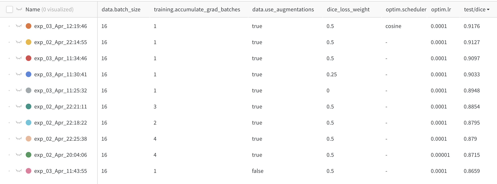

<script type="text/javascript" src="http://cdn.mathjax.org/mathjax/latest/MathJax.js?config=TeX-AMS-MML_HTMLorMML"></script>
<script type="text/x-mathjax-config"> MathJax.Hub.Config({ tex2jax: {inlineMath: [['$', '$']]}, messageStyle: "none" });</script>

# CISC 881 Assignment 3

> Author: Paul Wilson
> Date: April 3, 2022

## Introduction

Prostate cancer is the second most common cancer in men worldwide and presents a significant burden of disease. There is significant variability in the prostate cancer, ranging from indolent to extremely aggressive tumors. Effective treatment depends on early and accurate diagnosis. First-line tests such as digital rectal examination and prostate-specific antigen testing can identify men at higher risk of having prostate cancer, but a combination of imaging and biopsy is required to confirm diagnosis. The most common technique is transrectal ultrasound (TRUS) guided biopsy of the prostate. Unfortunately, TRUS provides relatively poor visualization of the prostate tissue and gives little information about the presence and location of tumours.

Magnetic Resonance Imaging (MRI) provides a much better of visualization of tissue structures than ultrasound. It can be used to visualize the prostate and surrounding region to diagnose cancer and determine if cancer has spread. It can also be used to identify suspected tumours on the prostate, which can then be targeted directly using TRUS-guided biopsy. An MRI image of the prostate consists of a sequence of 2-dimensional "slices" taken along the axial plane of the body which are combined into a 3-dimensional image volume. 

It is necessary to segment the prostate from the surronding tissue to analyze its structure. Segmentations can be used to estimate the volume of this project. Segmentation is usually done manually by a trained radiologist. This process is time consuming. There have been significant efforts made to automate the segmentation task. Recent advances in deep learning have led to promising improvements in automated image segmentation. In this project, we perform exploratory data analyis of MRI data for the purpose of developing automated segmentation models using deep learning. 

## Dataset

Our dataset comes from the [PROMISE 12 grand challenge](https://promise12.grand-challenge.org/), which is publicly available for download. The training porion of the dataset includes prostate MRIs and segmentation masks for 50 patients, in `.mhd` format. 

## Code
Our code is publicly available on github at [pfrwilson/mri-expert](https://www.github.com/pfrwilson/mri-expert). To quick-run the code, simply download the training data from the grand challenge, note the path to the `TrainingData` folder, and run:

```bash
git clone https://github.com/pfrwilson/mri-expert
pip install -r requirements.txt
python main.py data.root="/path/to/TrainingData" log=False log_images=False
```

If wandb is enabled and logged in, you can use `log=True` to log metrics to your wandb account under the project "mri-expert". 

All library code is in the `src` package. Other than this, we have the `configs` folder containing the `config.yaml` folder which can be altered to change experimental configurations, and the `main.py` file which is the entry point to the code, and runs the main training and evaluation script.

### Model

The model is an implementation of U-net taken from [this repository](https://github.com/milesial/Pytorch-UNet). It is in the `src/unet` package. 

### Dataset

The `src/data` package contains the main dataset class, as well as utility functions for data processing and data exploration. The main functionality of the package is to build train, validation, and test dataloaders, which is handled in `src/data/__init__.py`. 

### Early Stopping 

The training script uses an early stopping callback to cut off training when validation loss no longer improves, and which saves the model whenever the validation loss hits a low. This is defined in `src/early_stopping.py`.

### Logging

Our code uses wandb for logging. The `src/logging` file also provides utility functions for creating images of masks and mri together and either saving them or logging them to wandb. 

### Training/Prediction

The main training and evaluation loops are defined in `src/train.py` and the prediction loop (which generates a report organized by case number and containing all the metrics and predicted masks) is defined in `src/predict.py`. The loss criterion is defined in `loss.py`.

## Step by Step

### 1.

The raw data is in `.mhd` format, and the different cases do not all have the same pixel spacing. We resample all of these volumes and masks to the reference spacing (0.625, 0.625, 3.6) (mm in the x, y and z directions). This is done in the `create_processed_dataset` method of the `src.data.dataset.PCASegmentationDataset` class. 

### 2. 

As the resampling results in images of different height and width dimensions, we utilize a center crop (`src.data.utils.center_crop`) to crop all the slices to the same height and width dimention.

### 3. 

By estimating prostate volume by adding up the voxels inside the prostate mask for each slice, we select the 5 slices with the largest prostate volume for each case. These images are saved in a temporary directory as numpy arrays so that they can be loaded into memory dynamically during training. This is done in the `create_processed_dataset` method of the `src.data.dataset.PCASegmentationDataset` class. 

### 4. 

We utilize data augmentation defined by the `src.data.proprocess.Preprocessor` callable object. Augmentations can be turned on and off using the `data.use_augmentations` of the config file. When on, augmentations consist of:
- randomly flipping horizonally, 
- randomly rotating by at most 15 degrees, 
- randomly applying a grid distortion, 
- randomly adjusting brightness, 
- randomly applying gaussian blur
Augmentations are applied the same way to the mri images and the ground truth segmentation masks. They are applied during training but not evaluation or prediction. Using augmentations resulted in a higher dice score ($.91$ vs $.86$) on the test set. We did not perform extensive ablations on applying some augmentations and not others. All augmentations were randomly applied in sequence.

### 5. 

Preprocessing the data for input to our model also involved normalizing each image to a variance of 1 and mean of 0 (pixel-wise) and converting the image to a pytorch tensor, handled by the `Preprocessor` class as well. 

### 6. 

To split the data into training, validation and testing sets by randomly assigning the cases into groups such that 30, 10 and 10 cases were assigned to each group respectively. We ensured that the case of interest (case 33) was in the test set. Splitting by cases ensures that no information is leaked between the sets. The segregation between test-and non-test data is fixed, but train/validation sets can be reassigned by adjusting the `data.split_seed` configuration. We did not use k-fold cross-validation splits due to time constraints, which is a limitation of this study. We note that our models showed consistently lower scores on the validation compared to test subjects. To ensure generalizability, our models should be validated on prospective data (eg. an independent test set. )

### 7. 

As mentioned in the "Code" section, we used an [open-source implementation of U-net](https://github.com/milesial/Pytorch-UNet). We did not modify this architecture. The model is free to use under the GNU licence which we included in our repository.

### 8. 

The dice score 
$$ \text{dsc} = \frac{ 2 * |\text{true} \cap \text{pred}| }{|\text{true}| + |\text{pred}|}, $$ 
where $\text{true}$ and $\text{pred}$ are the true and predicted segmentation masks of the prostate, was used to measure the performance of our model. Our model was trained to directly minimize the dice loss (mean of $1 - \text{dsc}$ over batches). However, we experimented with a combined loss of weighted sum of pixel-wise cross-entropy + dice score and found the best performance with the weighting factor of $0.5$ (see `src.loss.SegmentationCriterion` and `dice_loss_weight` in config). In other words, a combination of cross-entropy and dice loss worked better than either loss function alone. 

### 9. 

We trained our model utilizing early-stopping to cut off training when an improvement in the validation loss is not observed for 10 consecutive epochs. During training, metrics of average dice score, average jaccard score and average loss are calculated on the test and evaluation sets. We log these results to wandb, which allows us to visualize graphs and table for each of the runs. See the results at (https://wandb.ai/pfrwilson/mri-expert). Whenever an improvement in loss is observed, a model checkpoint is saved locally for future use. 

### 10. 

The final value of performance for training, validation, and test data are logged under `train/dice`, `val/dice`, and `test/dice` on wandb, and can be easily accessed there for each experimental run using the table view:


Here, we show the best 10 runs ordered in descending order based on the dice score on the test set. 

### 11. 

During training and evaluation, we log sample images with true and predicted masks to wandb. After training, we perform a run of prediction on the test data which involves organizing the data into cases and predicting the segmentation mask for each slice of each case. The mri, predicted and true segmentations are logged to wandb and can be referenced by case number. Simply click on the run, open the predict tab, and under "media", you can see a collection of images. By adjusting the settings, we can create a view where the predicted mask is shown in transparent red, the true background is shown in transparent blue, and both are overlaid over the mri images. An example of this visualization is shown below: 


We also create a similar visualization for the largest slice of the mask using matplotlib and save is locally in the outputs folder. Here is an example of this visualization: 


### 12. 

We performed a grid search for the best batch size and learning rate, trying : 
> `lr = [1e-6, 1e-5, 1e-4, 1e-3]`
> 
> `bsz = [16, 32, 64]`

Note that as our GPU memory could not handle physical batch size 32, we utilized gradient accumulation over multiple batches to increase the virtual batch size. The best results were with batch size $16$ and learning rate $0.0001$. We also found that using augmentations performed significantly better than not using augmentations, and that using a cosine-annealed learning rate schedule resulted in a very small additional performance improvement. 

All of these findings measure performance of the model based on the best dice score on the training set. Results are shown in the table below, which contains only the 10 best results in ascending order. 



Our best result was a dice score of $\approx 0.92$ on the test set. 