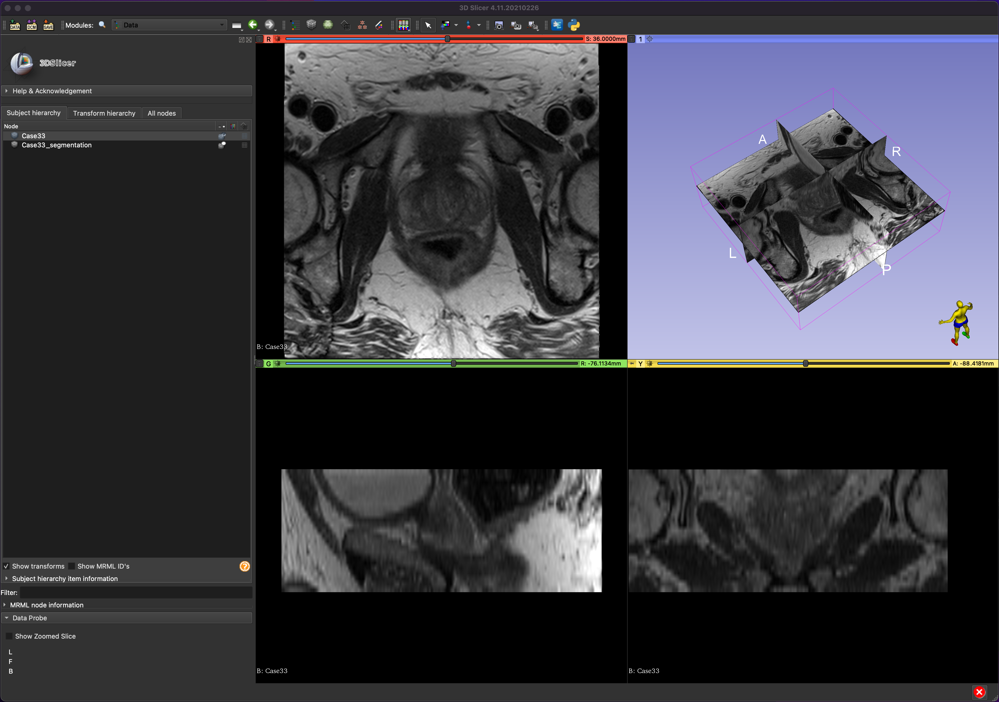
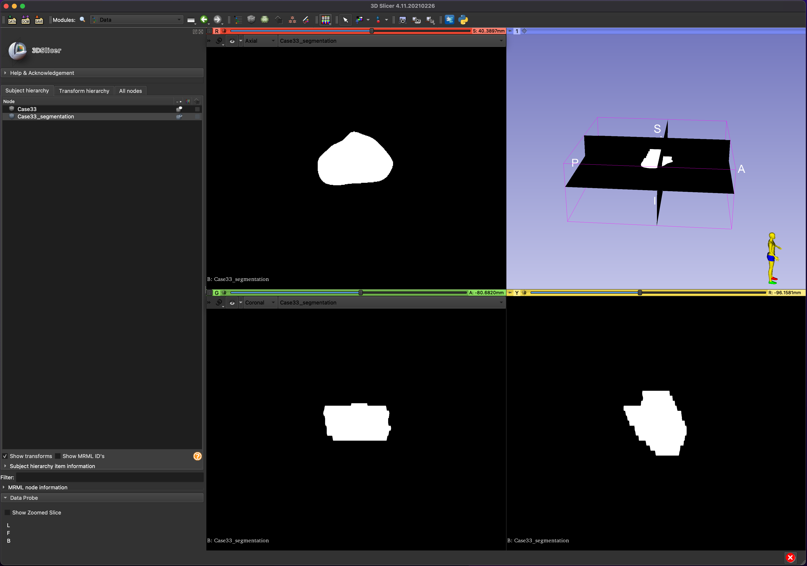
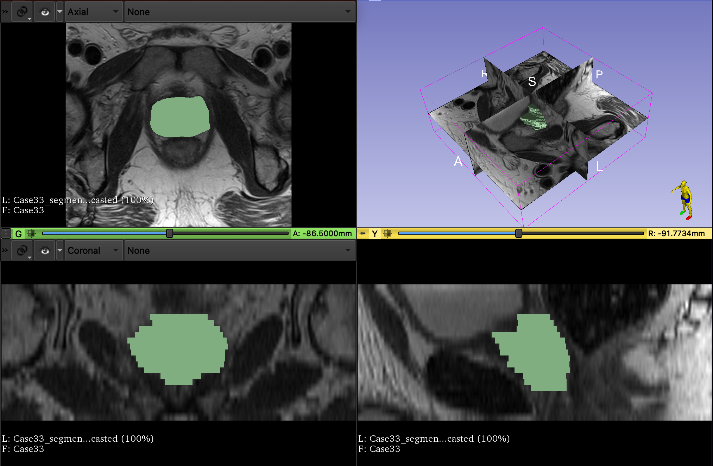
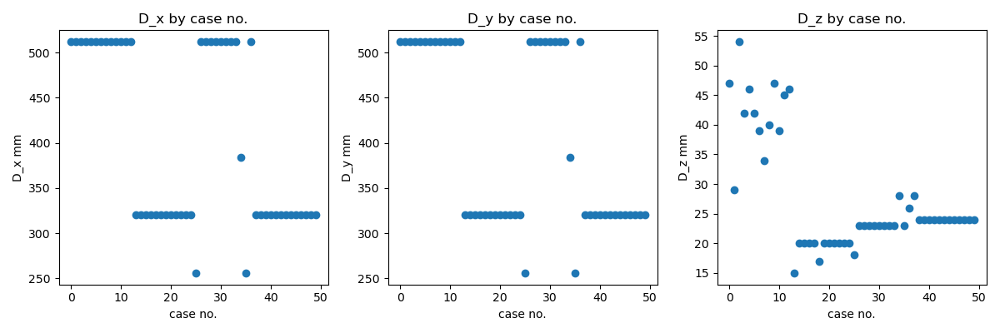
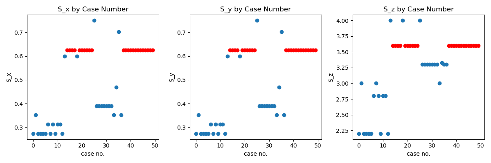
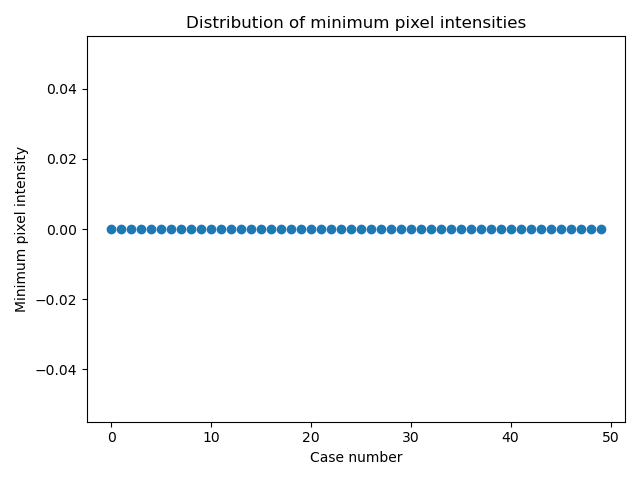
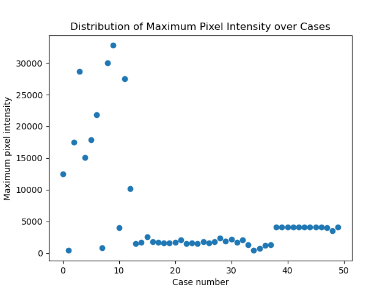
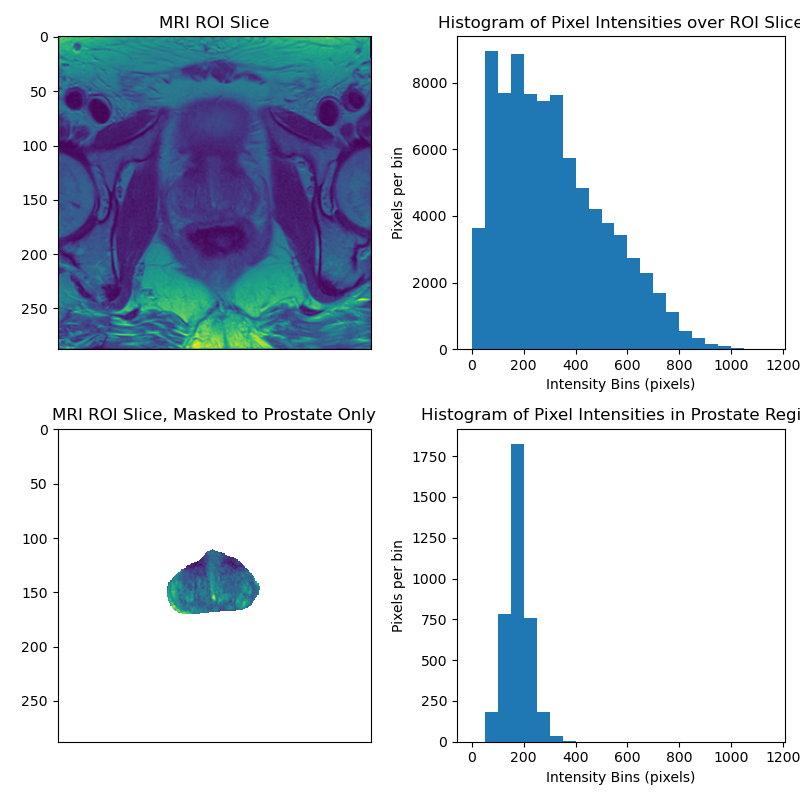

<link rel="stylesheet" href="https://cdnjs.cloudflare.com/ajax/libs/KaTeX/0.5.1/katex.min.css">

    Title: Medical Imaging (CISC 881) Assignment 1
    Author: Paul F R Wilson
    Institution: Queen's University
    Date: Jan 15, 2022

# Medical Imaging (CISC 881) Assignment 1 
## Introduction

Prostate cancer is the second most common cancer in men worldwide and presents a significant burden of disease. There is significant variability in the prostate cancer, ranging from indolent to extremely aggressive tumors. Effective treatment depends on early and accurate diagnosis. First-line tests such as digital rectal examination and prostate-specific antigen testing can identify men at higher risk of having prostate cancer, but a combination of imaging and biopsy is required to confirm diagnosis. The most common technique is transrectal ultrasound (TRUS) guided biopsy of the prostate. Unfortunately, TRUS provides relatively poor visualization of the prostate tissue and gives little information about the presence and location of tumours.

Magnetic Resonance Imaging (MRI) provides a much better of visualization of tissue structures than ultrasound. It can be used to visualize the prostate and surrounding region to diagnose cancer and determine if cancer has spread. It can also be used to identify suspected tumours on the prostate, which can then be targeted directly using TRUS-guided biopsy. An MRI image of the prostate consists of a sequence of 2-dimensional "slices" taken along the axial plane of the body which are combined into a 3-dimensional image volume. 

It is necessary to segment the prostate from the surronding tissue to analyze its structure. Segmentations can be used to estimate the volume of this project. Segmentation is usually done manually by a trained radiologist. This process is time consuming. There have been significant efforts made to automate the segmentation task. Recent advances in deep learning have led to promising improvements in automated image segmentation. In this project, we perform exploratory data analyis of MRI data for the purpose of developing automated segmentation models using deep learning. 

## Dataset

Our dataset comes from the [PROMISE 12 grand challenge](https://promise12.grand-challenge.org/), which is publicly available for download. The training porion of the dataset includes prostate MRIs and segmentation masks for 50 patients, in `.mhd` format. 

## Goals

The goal of this assignment is to gain insight into the structure of the dataset. We hope to understand the stucture of the data and the distribution of various features among the various cases. We hope to extract some meaningful summary statistics describing our dataset. Ultimately, this knowledge will help us determine what pre-processing steps are needed in order prepare the data for processing by a neural network. 

## Code

Our code consists of two python modules. The module `prostate_mri.py` defines the `ProstateMRIDataset` class which wraps the mri dataset. An instance of the class can be used to easily access specific data points either in `np.ndarray` or `sitk.Image` format. It also can be used to access a table of data statistics, with the option of resampling the data to obtain a uniform pixel spacing. The module `main.py` is used to create an instance of this class and plot a number of visualizations which we will show below. Both modules make heavy use of the `SimpleITK` image processing toolkit, and some other standard python data science libraries. 

## Results

### 3D Slicer

We opened the MRI image and segmentation data in [3D Slicer](https://www.slicer.org/) for interactive visualization. 

1. A visualization of image slices along the axial, saggital and coronal planes:
    
    

2. A visualization of the corresponding prostate mask 
    
    

3. A visualization of the segmentation mask overlaid over the corresponding MRI image, with a 3-d rendering of the segmentation volume
   
   

### Summary Statistics, Plots and Histograms

1. Distrbution of the image dimensions in the x, y, and z directions. Note that the z direction corresponds to the axial direction, so that `D_x` and `D_y` correspond to the resolution of a single MRI image slice while `D_z` corresponds to the number of such slices taken. 

    

    observe that there are groups of cases with the exact same dimensions, likely corresponding to the clinical protocols of data collection at specific MRI centers. There is more variability in the D_z dimension, possibly because the volumes were restricted to a specific region of interest (ROI) in this dimension.

2. Distribution of the pixel spacing in the x, y, and z directions.
    
    

    observe that there is again significant variability in pixel spacing among cases, with some distinct groupings. Note that a lower pixel spacing corresponds to higher image resolution, so cases 0-10 have the highest resolutions. Units are in millimeters. Resolution is significantly lower in the axial dimension. 

    The most frequent spacing is:  
    >(0.625 mm , 0.625 mm , 3.6 mm),
    
    a number we call the reference spacing. Point in the distribution which have the reference spacing are marked in red. 

3. Estimated prostate volume among cases:
   
    

    The prostate volumes were estimated by multiplying the voxel sizes by the number of voxels in the segmentation mask. Note that there is a clear distribution with an average around 50 cubic centimeters. There is clear outlier with a prostate volume of over 300 cubic centimeters, and several other cases with clearly enlarged prostates. The most significant outlier corresponded to case 30, which upon closer inspection showed signs of a large tumour in the prostate. 

4. Distribution of minimum and maximum intensities among cases: 
    
    

    
    
    While the minimum pixel intensity was uniformly 0 across all cases, the maximum pixel intensity varied significantly, especially among cases 0-15. This indicates the need for a preprocessing step which normalizes pixel values into a range that is uniform across the seperate cases. 

5. Histogram of voxel intensities in the overall MRI image and within the prostate mask region: 
    
    

    Note the significantly different distribution of pixel intensities in the image as a whole and inside the prostate region. While the image as a whole has a broad range of intensity values from 0 to 1200 with the number of pixels per bin decreasing in an approximately linear fashion as pixel intensity increases, the prostate region has a fairly tight bell-curve shaped distribution with a mean intensity of roughly 200. Almost all of the pixel intensities of the prostate region fall in the range (50, 350], indicating that a simple intensity threshold may assist the segmentation algorithm. 

    Future work should confirm whether these distributional differences persist across the different cases and across other axial slices (we only looked at the slice with the largest segmentation area), following pixel intensity normalization. 

6.  We re-sampled the data using the SimpleITK `Resample` method to adjust any cases not following the reference spacing to follow the reference spacing. This fix will be a necessary pre-processing step for a segmentation network, as the resolution is now uniform across different cases. We used linear interpolation for resampling the MRI image, but found that nearest neighbor interpolation was necessary for the segmentation images to roughly preserve prostate volume estimates. 

7. Histogram of voxel intensities from case 23 following resampling. Again, we use the slice corresponding to the largest prostate area. 
    
    

    Note that there are only minor visual differences from example E. in the images themselves. Furthermore, although the histogram of pixel intensities for the overall image changes slightly following resampling (likely due to averaging effects of linear interpolation), the histogram corresponding to the prostate mask region remains similar, as desired. 